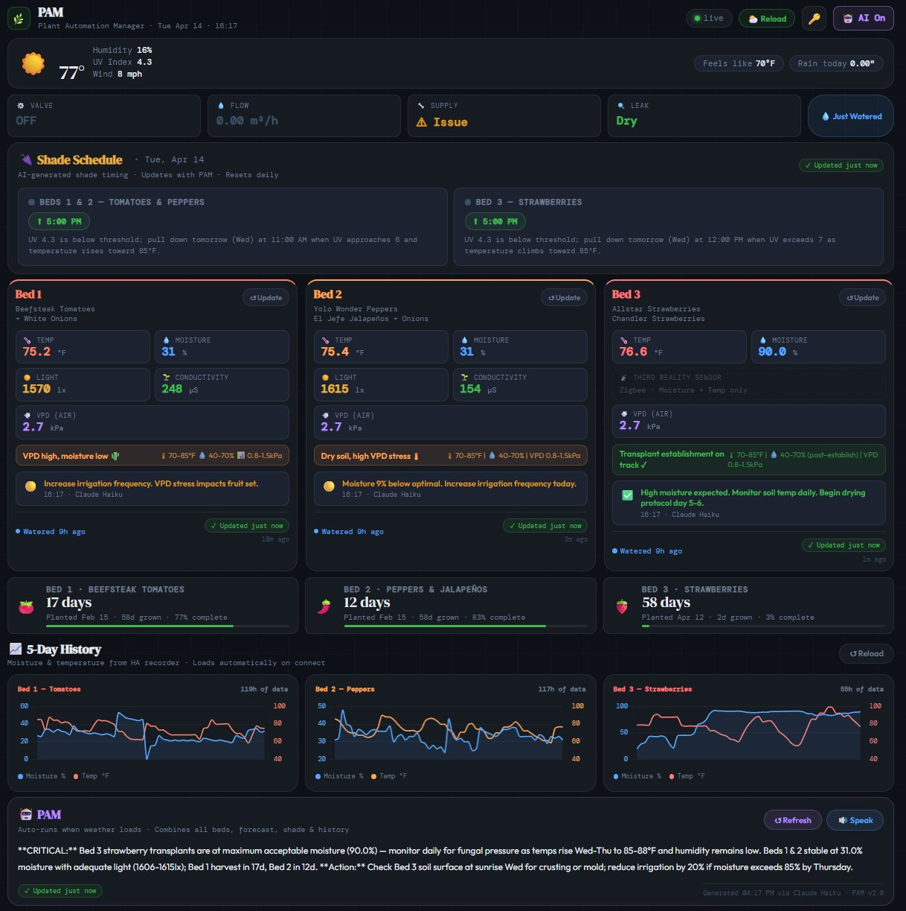
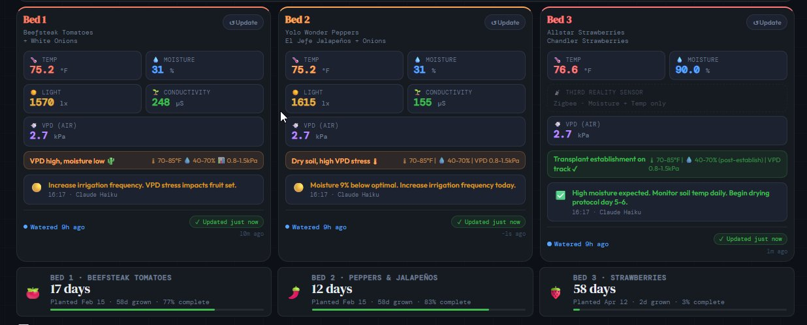
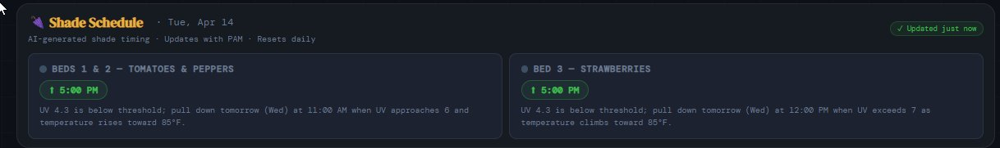
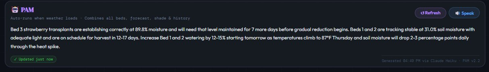
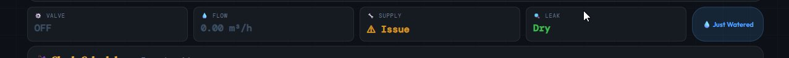
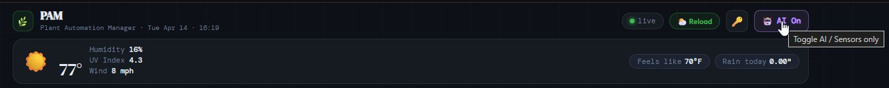

# PAM — Plant Automation Manager

> **Real-time garden monitoring dashboard for Home Assistant.**  
> Live soil sensors · AI-powered advice · Shade scheduling · Irrigation status · 5-day history charts

Works with **any AI provider** — Claude (default), OpenAI, Gemini, or any OpenAI-compatible API.  
Or skip AI entirely and run in **Sensors Only** mode — zero API cost, full dashboard.

---

## 📸 Screenshots

| Dashboard Overview | Bed Analysis | Shade Schedule |
|---|---|---|
|  |  |  |

| PAM AI Summary | Key Setup Modal | Header Controls |
|---|---|---|
|  |  |  |

---

## What is PAM?

PAM is a single-file HTML dashboard that connects to Home Assistant via WebSocket, reads live Zigbee/Bluetooth soil sensor data, and optionally uses an AI API to generate actionable garden advice — all with no server, no build step, and no install beyond dropping one file into your HA `www` folder.

**Core features:**

- **Live sensor data** — soil temperature, moisture, light, conductivity, VPD per bed
- **AI bed analysis** — per-bed advice with health status and 5-point action items
- **PAM summary** — combined daily briefing across all beds, weather, and harvest status
- **Shade schedule** — AI-generated daily shade cloth timing based on UV, temp, and forecast
- **5-day history charts** — moisture and temperature trend lines from HA recorder
- **Harvest countdown** — days to harvest with progress bars per bed
- **Irrigation status** — live valve state, flow rate, leak detection, water supply
- **Watered tracking** — auto-detects watering via moisture rise; manual log; persists to HA
- **TTS integration** — speaks PAM summary to any HA media player
- **Sensors Only mode** — full dashboard with zero AI calls, toggled from the header
- **First-run key setup** — enter your API key once via in-app modal; saved to localStorage
- **Offline cache** — last AI advice survives page reloads via localStorage + HA input_text

---

## Hardware Reference Setup

| Component | Purpose |
|---|---|
| Home Assistant Green | HA host |
| Xiaomi/HHCC Plant Sensors (Bluetooth) | Beds 1 & 2 — temp, moisture, light, conductivity |
| Third Reality Zigbee Soil Sensor | Bed 3 — temp + moisture |
| Ambient Weather Network station | Local ambient temp, humidity, UV, wind, rain |
| Sonoff Zigbee Irrigation Controller | Valve, flow rate, leak detection |
| Google Hub Max | Dashboard display via Cast |
| ESP32 Bluetooth Proxy | Relays BT plant sensors to HA |

> PAM works with any sensors — just update the entity names in the `CONFIG` block.

---

## Prerequisites

- **Home Assistant** (any recent version) with `recorder` enabled
- **HA Long-Lived Access Token** — Settings → Profile → Security → Long-Lived Access Tokens
- **AI API key** — only needed if using AI features (see [AI Provider Setup](#ai-provider-setup))

---

## Installation

### 1. Copy the file to HA

Place `pam_2.2.html` in your HA `www` folder:

```
/config/www/pam_2.2.html
```

Accessible at:
```
http://YOUR_HA_IP:8123/local/pam_2.2.html
```

### 2. Create HA Helper Entities

PAM needs helper entities to persist watered timestamps and AI advice cache.

On first load, PAM shows a **⚙️ HA Setup** panel at the bottom with a copy button. Paste into `configuration.yaml` and restart HA. The panel hides itself once all helpers exist.

Or add manually:

```yaml
input_datetime:
  garden_bed_1_last_watered:
    name: "Garden Bed 1 Last Watered"
    has_date: true
    has_time: true
    icon: mdi:water
  garden_bed_2_last_watered:
    name: "Garden Bed 2 Last Watered"
    has_date: true
    has_time: true
    icon: mdi:water
  garden_bed_3_last_watered:
    name: "Garden Bed 3 Last Watered"
    has_date: true
    has_time: true
    icon: mdi:water-outline

input_text:
  garden_advice_b1:
    name: "Garden Advice Bed 1"
    max: 255
  garden_advice_b2:
    name: "Garden Advice Bed 2"
    max: 255
  garden_advice_b3:
    name: "Garden Advice Bed 3"
    max: 255
  garden_intelligence:
    name: "Garden Intelligence"
    max: 255
```

### 3. Configure PAM

Edit the `CONFIG` block near the top of the `<script>` section:

```javascript
const CONFIG = {
  lat:      33.5,                  // Your latitude
  lon:      -112.1,                // Your longitude
  timezone: 'America/Phoenix',     // IANA timezone string
  location: 'Glendale, Arizona',   // Used in AI prompts

  tts_player: 'media_player.your_speaker',

  beds: [
    { id: 1, name: 'Your Bed 1 Plants', planted: 'YYYY-MM-DD', days_to_harvest: 75, label: 'days to harvest' },
    { id: 2, name: 'Your Bed 2 Plants', planted: 'YYYY-MM-DD', days_to_harvest: 70, label: 'days to harvest' },
    { id: 3, name: 'Your Bed 3 Plants', planted: 'YYYY-MM-DD', days_to_harvest: 60, label: 'days to first fruit' },
  ],

  sensors: {
    bed1: {
      temp:         'sensor.your_bed1_temperature',
      moisture:     'sensor.your_bed1_moisture',
      illuminance:  'sensor.your_bed1_illuminance',
      conductivity: 'sensor.your_bed1_conductivity',
    },
    // bed2, bed3 same structure — set illuminance/conductivity to null if unavailable
  },
};
```

### 4. Open PAM

```
http://YOUR_HA_IP:8123/local/pam_2.2.html?token=YOUR_HA_TOKEN
```

**HA Dashboard card (recommended):**

```yaml
type: vertical-stack
cards:
  - type: iframe
    url: /local/pam_2.2.html?token=YOUR_HA_TOKEN
    aspect_ratio: "16:9"
grid_options:
  rows: 16
  columns: 48
```

> Adjust `aspect_ratio` and `rows` to taste — `16:9` gives the full dashboard with scrolling. Try `21:9` for more height on a widescreen display.

### How to add PAM to your HA dashboard

1. Open your Home Assistant dashboard
2. Click the **pencil ✏️ Edit** button (top right)
3. Click **+ Add Card**
4. Scroll down and select **Manual**
5. Delete the placeholder YAML and paste the block above
6. Replace `YOUR_HA_TOKEN` with your Long-Lived Access Token
7. Click **Save**

PAM will load inside the dashboard card. On first load the API key modal appears — enter your key and click **Save & Continue**.

**To get your HA Long-Lived Access Token:**
1. Go to **Settings → Profile** (bottom left, your username)
2. Scroll to **Security → Long-Lived Access Tokens**
3. Click **Create Token** → give it a name like `PAM`
4. Copy the token immediately — it's only shown once Enter your key and it's saved to localStorage — you won't be asked again. **Bookmark this URL.**

---

## AI Provider Setup

PAM ships with Claude (Anthropic) but the AI call is a single swappable function.

### Default — Anthropic Claude

1. Get your key at [console.anthropic.com](https://console.anthropic.com) → API Keys → Create Key
2. Enter it in the PAM setup modal on first load

**Recommended model:** `claude-haiku-4-5-20251001`  
**Typical cost:** under $0.01 per full run

### Switching to OpenAI

Replace the `callClaude()` function in `pam_2.2.html`:

```javascript
async function callClaude(prompt) {
  if (!AI_MODE) return '';
  if (!CLAUDE_KEY) throw new Error('No API key');
  const r = await fetch('https://api.openai.com/v1/chat/completions', {
    method: 'POST',
    headers: { 'Content-Type': 'application/json', 'Authorization': 'Bearer ' + CLAUDE_KEY },
    body: JSON.stringify({ model: 'gpt-4o-mini', max_tokens: 800, messages: [{ role: 'user', content: prompt }] })
  });
  const d = await r.json();
  if (d.error) throw new Error(d.error.message);
  return d.choices?.[0]?.message?.content || '';
}
```

### Switching to Google Gemini

```javascript
async function callClaude(prompt) {
  if (!AI_MODE) return '';
  if (!CLAUDE_KEY) throw new Error('No API key');
  const r = await fetch(
    `https://generativelanguage.googleapis.com/v1beta/models/gemini-2.0-flash:generateContent?key=${CLAUDE_KEY}`,
    { method: 'POST', headers: { 'Content-Type': 'application/json' },
      body: JSON.stringify({ contents: [{ parts: [{ text: prompt }] }] }) }
  );
  const d = await r.json();
  if (d.error) throw new Error(d.error.message);
  return d.candidates?.[0]?.content?.parts?.[0]?.text || '';
}
```

### Switching to a local model (Ollama / LM Studio)

```javascript
const r = await fetch('http://localhost:11434/v1/chat/completions', {
  method: 'POST',
  headers: { 'Content-Type': 'application/json' },
  body: JSON.stringify({ model: 'llama3', max_tokens: 800, messages: [{ role: 'user', content: prompt }] })
});
```

> For local models, enter any non-empty string (e.g. `local`) as the API key in the modal.

---

## Sensors Only Mode

Run PAM with **zero AI calls** — no API key needed.

Toggle with the **📡 Sensors / 🤖 AI On** button in the top-right header. Saved to localStorage.

**In Sensors Only mode:**
- All AI buttons are hidden
- No API calls are made — zero cost
- Weather still loads from Open-Meteo (always free)
- All sensor data, history charts, irrigation status, and harvest countdown work normally
- Shade schedule shows "manage manually"

---

## Using PAM

### Header Controls

| Button | Function |
|---|---|
| **⛅ Load Weather** | Fetches 4-day forecast from Open-Meteo |
| **🔑** | Open API key setup / update modal |
| **🤖 AI On / 📡 Sensors** | Toggle AI mode on or off |

> PAM is designed to run embedded in a Home Assistant dashboard iframe card. Add it via **Settings → Dashboards → Add Card → Manual → iframe**.

### AI Features (AI mode only)

| Button | What it does |
|---|---|
| **✨ Analyze** (per bed) | Sends sensor snapshot to AI — returns health status + 5-point advice |
| **↺ Refresh** (PAM panel) | Re-runs full garden briefing + shade schedule |
| **🔊 Speak** | Sends PAM summary to TTS media player |

### Watered Tracking

- **💧 Just Watered** — logs current time to all 3 beds at once
- **Auto-detection** — moisture rise ≥3% triggers automatic timestamp
- Persists across reboots via HA `input_datetime` helpers

---

## 📷 Screenshot Guide

Exact shots needed for the README table:

| File | What to capture |
|---|---|
| `screenshots/dashboard.png` | Full page with sensors live and weather loaded — header through harvest countdown |
| `screenshots/bed-analysis.png` | 1-2 bed cards after ✨ Analyze — show health strip and advice card |
| `screenshots/shade-schedule.png` | Shade schedule panel with both groups showing ⬇/⬆ time pills |
| `screenshots/pam-summary.png` | PAM purple summary panel with briefing text and fresh badge visible |
| `screenshots/history-charts.png` | All 3 history chart cards with moisture + temp lines loaded |
| `screenshots/key-modal.png` | Key setup modal open (click 🔑 to trigger) |

> **Tip:** Chrome DevTools device toolbar at 1280×800 gives consistent sizing. Screenshots from the Hub Max display also work great.

---

## Troubleshooting

| Issue | Fix |
|---|---|
| "auth error" badge | Regenerate HA token — Settings → Profile → Security |
| Sensor values show `--` | Entity IDs in CONFIG don't match HA — check Developer Tools → States |
| AI not working | Click 🔑 to verify key is saved; test at your provider's console |
| History shows "no data" | HA `recorder` must be enabled with history for those entities |
| Shade schedule empty | Load weather first, then tap ↺ Refresh |
| TTS Speak fails | Check `tts_player` entity in CONFIG |
| Wrong provider error | Updated provider but old key type — re-enter key via 🔑 modal |

---

## Security Notes

- HA token is in the URL — visible in browser history. Don't share the URL.
- API key is in `localStorage` after first entry — not in source code, not in URL.
- Use VPN or Tailscale if accessing HA externally.

---

## Version History

See [CHANGELOG.md](CHANGELOG.md) for full details.

| Version | Highlights |
|---|---|
| v2.2 | Transplant badge · Markdown fix · Permanent embed layout · Full screenshot set |
| v2.0 | Sensors Only mode · AI provider toggle · First-run key modal · LLM-agnostic |
| v1.0 | Initial public release |

## 🗺️ Roadmap — Coming in v3.0

These features are planned for the next major update:

| Feature | Description |
|---|---|
| 📷 Camera integration | ESP32-S3 Sense feed + LLM vision analysis triggered from PAM |
| 🌱 Feeding tracker | EC/conductivity threshold alerts — PAM flags when it's time to fertilize |
| 📱 Mobile layout | Optimized layout for HA mobile app |
| ⏰ AI on schedule | Auto-run PAM summary every morning via HA automation — no manual trigger needed |

> AI analysis is currently manually triggered to keep API costs low. Scheduled AI will be opt-in in v3.0.

---

## License

MIT — free to use, modify, and share.

---

## Credits

Built with [Home Assistant](https://www.home-assistant.io) · [Anthropic Claude](https://anthropic.com) · [Open-Meteo](https://open-meteo.com) · [Chart.js](https://www.chartjs.org)
